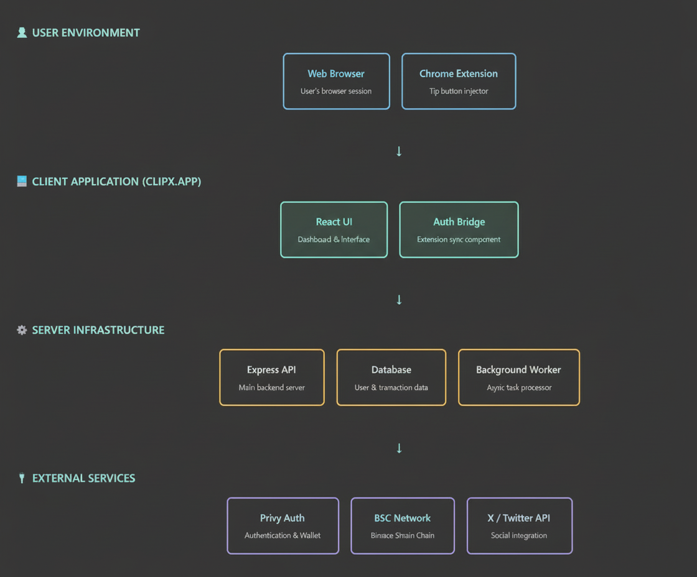

# ClipX: Tipping at the Speed of Social 🚀


> **Send Crypto Directly on X (Twitter) with One Click.**

ClipX is a powerful browser extension and platform that bridges the gap between social interaction and financial value. If you love a tweet, you should be able to reward the creator instantly, without leaving the app.

---

## 🌟 Features

### 💎 Native Integration
Lives right inside the X (Twitter) interface. The "Tip" button feels like it belongs there, integrated naturally next to "Like" and "Retweet".

### ⚡ Zero Friction
Tip in seconds without leaving the page. No more asking for wallet addresses, copying/pasting, or switching apps.

### 🪙 Multi-Token Support
Support for major tokens and ecosystem favorites:
- **BNB** (Native)
- **USDT** (Stablecoin)
- **CLIPX** (Governance)
- **ASTER**
- **GIGGLE**

### 🔐 Seamless Authentication
- **One-Click Login**: Log in once on our dashboard using **Privy**.
- **Auto-Sync**: The extension automatically detects your session. No separate login required.

### 🕵️ Private Tipping
Want to support someone quietly? Toggle **"Private Tip"** to send funds without broadcasting a public reply.

---

## 🚀 The "Viral" Escrow System

**Tip Anyone, Anywhere.**
You can tip *anyone* on X, even if they haven't installed ClipX yet!

1.  **Send a Tip**: You tip `@UserWhoIsNotOnClipX`.
2.  **Escrow Vault**: Funds are held securely in our smart contract/escrow system.
3.  **Notification**: Our bot replies: *"Hey @User, you have pending crypto! Claim it at clipx.app"*
4.  **Claim**: The user signs up and claims their funds.

---

## 🛠️ Technology Stack

- **Frontend**: React, Vite, TailwindCSS, Shadcn/UI
- **Backend**: Node.js, Express
- **Database**: PostgreSQL (NeonDB), Drizzle ORM
- **Blockchain**: Binance Smart Chain (BSC)
- **Auth & Wallets**: Privy.io
- **Bot**: Python (Tweepy, Web3.py)

---

## 📦 Installation

### Prerequisites
- Node.js (v18+)
- Python (v3.8+)
- PostgreSQL

### Setup

1.  **Clone the repository**
    ```bash
    git clone https://github.com/ClipXonchain/ClipX_v1.git
    cd ClipX_v1
    ```

2.  **Install Dependencies**
    ```bash
    npm install
    ```

3.  **Environment Variables**
    Copy `.env.example` to `.env` and configure your keys (Privy, Database, Twitter API).

4.  **Run Development Server**
    ```bash
    npm run dev
    ```

---

## 📄 Documentation

Detailed documentation is available in the `docs/` directory:

- [Deployment Guide](docs/DEPLOYMENT.md)
- [VPS Setup](docs/VPS_SETUP_2024.md)
- [Chrome Extension Info](docs/CHROME_STORE_JUSTIFICATION.md)
- [Detailed Setup Instructions](docs/SETUP_INSTRUCTIONS.txt)

---

## 🔄 Workflow



---

## 📜 License

Copyright (c) 2025 ClipX Team. All Rights Reserved.
